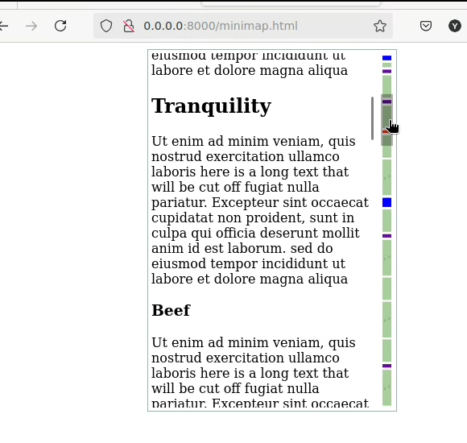

# Minimap scroll bar
Web component to add a custom minimap scroll bar to your web page. The minimap scroll bar is a small preview of the full page content that allows the user to quickly scroll to a specific section of the page.



## Installation
To install the minimap scroll bar, add the following script tag to your HTML file:
```html
<script src="https://cdn.jsdelivr.net/gh/y2kbugger/minimap-scrollbar@master/minimap.js" crossorigin="anonymous"></script>
```

## Example
An example html is included in the repository. To view the demo, open the `index.html` file in your browser. If you need to start a little server, you can use the following command:

```bash
python3 -m http.server
```
